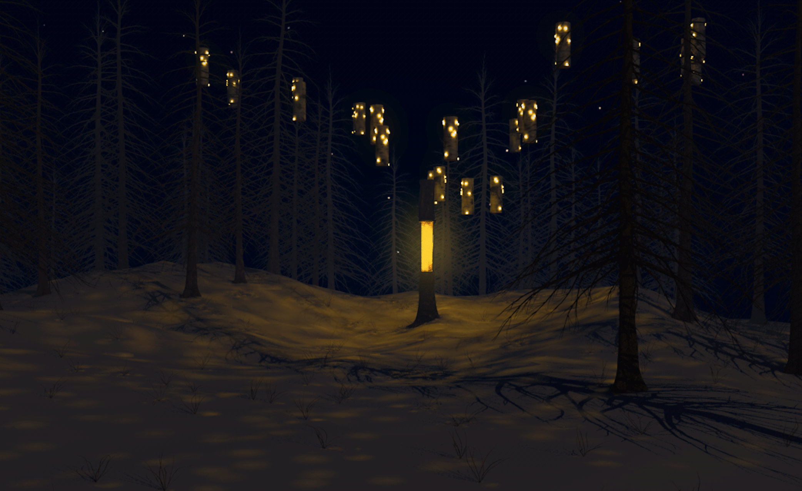

# Silva 
With the installation «Silva» (Latin forrest) we want to show what influence humans have on nature. A tree is to be created that shines as long as no one intervenes. Only after active disturbance does the tree run out of lights that symbolise its life. When visitors just look at the installation, the tree regenerates itself, recovers its energy and radiates again.

[Silva Zauberwald](https://lenzerheide.com/de/top-events/zauberwald/licht/silva)

«Silva» aims to raise the visitor's awareness of the importance of the forest.